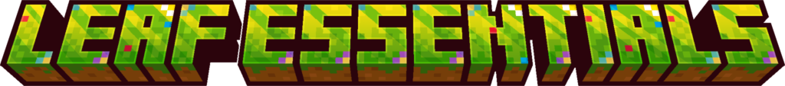
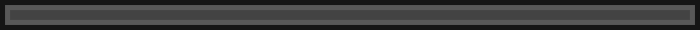
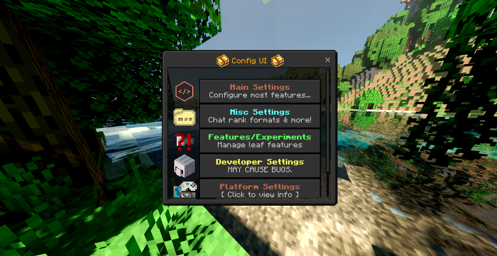

Leaf Essentials is a free and open source MCBE (Minecraft Bedrock Edition) addon that aims to **improve** your servers with many features.

We think customization is very important. You can customize many things in leaf. If there is not a UI that you need, chances are you can just make it yourself

# Features
- 🎨 Custom UIs
- 📃 Events that you can customize. Run commands whenever players kill another player.
- 💼 Chest GUIs
- 💻 Tab UIs
- 🔗 Bind commands to blocks, items, and entities
- 🏝️ Land claims
- 📊 Leaderboards
- 🔨 Reports
- 💬 Good Community
- ➕ And more!

# Installation
Go to the [MCBETools](https://mcbetools.com/s/leaf) page or the [MCPEDL](https://mcpedl.com/leaf) page

*NOTE: MCPEDL isnt recommended as its usually out of date. Please use MCBETools if possible*

# Support

Join the [Discord Server](https://discord.gg/EU7dcxUr2F) for support and to get announcements, and interact with other people in the MCBE community!

✨ Addon made by TrashyKitty! :3 ✨